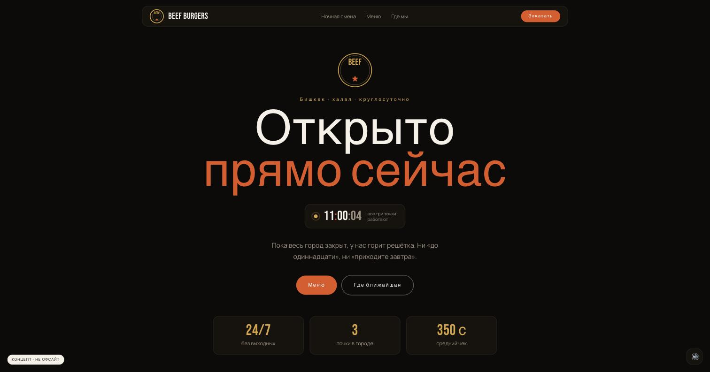
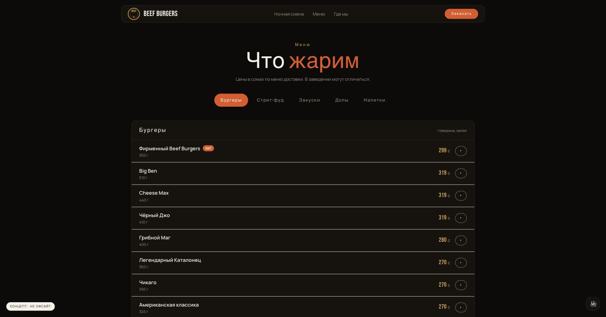

# Beef Burgers — концепт сайта

### 👉 [Живая демка](https://amanch1ik.github.io/beef-burgers-concept/)

Сайт для реальной бургерной в Бишкеке, **у которой нет сайта**. И даже не так: у них в Instagram-био **нет вообще никакой ссылки** — ни taplink, ни агрегатора. Только три адреса текстом и подпись «Работаем КРУГЛОСУТОЧНО».

> **Это концепт, а не официальный сайт.** Учебная работа. Точки, график, телефон и цены взяты из публичных источников самой сети и приведены **как есть, без выдумок**. Права на бренд и меню принадлежат Beef Burgers.



---

## Идея

У сети одна особенность, которая перевешивает всё остальное: **все точки работают круглосуточно**. Для фастфуда в Бишкеке это редкость и главный повод выбрать именно их в три часа ночи.

Поэтому сайт построен вокруг одного утверждения — **«Открыто прямо сейчас»** — и доказывает его тикающими часами, а не обещанием в подвале.

Отсюда же арт-дирекшн: тёмная тема здесь не мода, а попытка выглядеть как их вывеска ночью. Палитра снята с их айдентики — чёрная круглая эмблема и крафтовые пакеты: near-black `#0d0b0a`, крафт-янтарь `#d9a441`, угли `#e2541f`.

---

## Меню



Пять категорий, 43 позиции с ценами и граммовками: 18 бургеров (169–319 сом), стрит-фуд, закуски, допы и напитки.

Цены — из их страницы на «Ковёр-Самолёт». Это **цены доставки**, в заведении могут отличаться, и на странице меню об этом написано прямо.

---

## Точки


Три адреса, все круглосуточные. Рейтинги и число оценок — из карточек 2ГИС, как есть, включая невысокие: 3.4 и 3.5. Приукрашивать чужие оценки нельзя.

---

## Глава-пролёт

Кинематографичный пролёт по скроллу — та же техника, что у Apple: видео не играет само, его тайм-код привязан к позиции скролла. Пять сцен «ночной смены»: огонь → котлета → сборка → комбо → готово.

Движок — `scrub-engine.js` из [oso95/scroll-world](https://github.com/oso95/scroll-world) (MIT), футажи с [Mixkit](https://mixkit.co). Глава стоит **после** героя, но **до** меню: сначала утверждение «мы открыты», потом настроение, потом дело.

---

## Стек

| Слой | Технология |
|---|---|
| Сборка | Vite + React 19 |
| Стили | Tailwind CSS v4 (CSS-first) |
| Анимация | [Motion](https://motion.dev) 12 |
| Плавный скролл | [Lenis](https://lenis.darkroom.engineering) |
| Пролёт камеры | `scrub-engine.js` из [oso95/scroll-world](https://github.com/oso95/scroll-world) (MIT) |
| Звук | Web Audio API, синтез без единого аудиофайла |

```bash
npm install
npm run dev
npm run build
```

---

## Про логотип — важное

Настоящая эмблема сети (чёрный круглый бейдж «BEEF ★ BURGERS» с бургером внутри) на сайте **не используется**. Instagram отдаёт аватарку только по подписанным CDN-ссылкам, а рисовать копию по мотивам — это подделка чужого знака, а не работа с ассетами.

Сначала я поставил круглый бейдж-заглушку — и он выглядел ровно как заглушка: название жалось к верху, звезда болталась отдельно, середина пустая. Плюс повторять круглую форму их знака — это уже ближе к подделке, чем к плейсхолдеру.

Поэтому на странице **словесный знак**: только название, набранное типографикой, без имитации бейджа. Выглядит как осознанное решение, а не как «тут был бы логотип». Оригинал подставляется в одну строку.

---

## Инженерные заметки

### Движок пролёта рассчитан быть страницей целиком

Апстрим считает, что трек начинается на самом верху документа (`s.start = off * vh` против абсолютного `window.scrollY`). Здесь глава в середине страницы, поэтому отсчёт сдвинут на позицию контейнера (патчи помечены `// [BEEF patch]`):

```js
track.style.height = '0px'                                    // иначе трек сам себя смещает
base = track.getBoundingClientRect().top + window.scrollY
```

Второе следствие: все слои движка — `position: fixed`, и внутри обычной страницы они висят над остальным контентом. Гасить их приходится **и до главы, и после** — иначе тёмное небо накрывает герой сверху и меню снизу.

### `* { margin: 0 }` вне слоя ломает `mx-auto`

Утилиты Tailwind v4 лежат в `@layer utilities`, а **неслоёный CSS всегда бьёт слоёный** — привычный сброс `* { margin: 0 }` молча выключает центрирование по всему сайту. Reset уже делает preflight в `@layer base`.

---

## Данные

| Что | Источник |
|---|---|
| Точки, график, халяльность | [@beef_burgers_bish](https://instagram.com/beef_burgers_bish) и карточки 2ГИС |
| Телефон, рейтинги | 2ГИС |
| Меню, цены, граммовки | их страница на «Ковёр-Самолёт» (dostavka312.kg) |
| Футажи главы-пролёта | [Mixkit](https://mixkit.co), Mixkit Free License |

---

## Что не сделано

- **Настоящий логотип** — см. выше, нужен от сети.
- **Карта точек** — координат в открытых источниках нет, нужен геокодинг или выгрузка от них.
- **Онлайн-заказ** — сейчас у сети это живёт в Instagram-директе и агрегаторах.
- **Фотографии их блюд** — все снимки в Instagram, скачивать их из ленты без разрешения не стал.

---

## Лицензия

Код — MIT. Бренд, меню и данные принадлежат Beef Burgers и использованы в учебном концепте.
